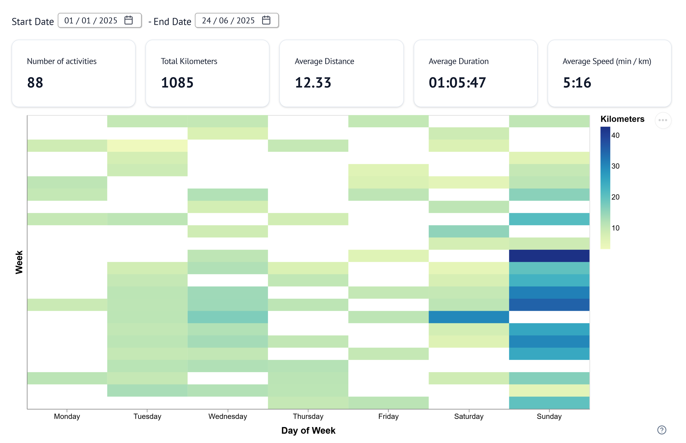

# Strava Marimo Analyzer 🏃‍♀️‍➡️​🏃‍➡️

A [Marimo](https://docs.marimo.io/) notebook for visualizing and analyzing your [Strava](https://strava.com/) activity data!

🚀 Powered by:
- [`strava-client`](https://github.com/GiovanniGiacometti/strava-client)
- [`polars`](https://pola.rs/)
- [`altair`](https://altair-viz.github.io/index.html)
- [`plotly`](https://plotly.com/)

🌐 A web-based version, running entirely in your browser via WebAssembly (WASM), is available [here](https://giovannigiacometti.it/strava-marimo-analyzer/).

## ✨ Features

The core feature of the dashboard is the **Activity Heatmap**, which provides a visual representation of the number of activities and total distance (in kilometers) over time. This interactive heatmap also displays key statistics for the currently selected activities — such as total number of activities, total distance, and average speed.

As both a developer and a runner, building a GitHub-style activity heatmap had been a long-time dream of mine! 🤓

In addition to the heatmap, the app includes three other visualizations that provide deeper insights into the selected activities:

- **Activity Focus**: a line plot showing speed over time for individual activities. You can select multiple activities from a dropdown to compare their speed profiles side-by-side.

- **Distance Distribution**: an aggregated histogram that shows how the distances of the selected activities are distributed.

- **Speed Distribution**: n aggregated histogram that displays the distribution of speeds across the selected activities.

I invite you to explore the dashboard [here](https://giovannigiacometti.it/strava-marimo-analyzer/) to see these visualizations in action!

---

The dashboard should be easy to be extended with new visualizations. If you have ideas for new visualizations or features, feel free to open a pull request or reach out — contributions are very welcome!

## 📥 Get Started with your data!

To begin, you'll need to authenticate your Strava account. The full process is explained in the [strava-client documentation](https://github.com/GiovanniGiacometti/strava-client?tab=readme-ov-file#authentication).

### If you are running this notebook locally

You can either provide your credentials through a .env file or set them directly in your terminal. When you run the notebook for the first time, a browser tab will open to authenticate your Strava account and retrieve an access token. All information are saved in a file called `.strava.secrets` file so you won’t need to re-authenticate in future sessions (make sure it is gitignored!).

### If you are using the web-based WASM version

You have two options, selectable via the form at the top of the notebook:

1) **Enter your own credentials:**
Since the browser cannot perform the full authentication flow, you need to retrieve the necessary information beforehand — for instance by using the `strava-client` locally. Note that this information is not stored in the browser, so you'll need to re-enter it each time you reload the page.

2) **Use sample (mocked) data:**
This option loads a set of pre-generated data based on my personal Strava activity. It allows you to explore the dashboard without needing your own Strava account or a Strava application setup.
